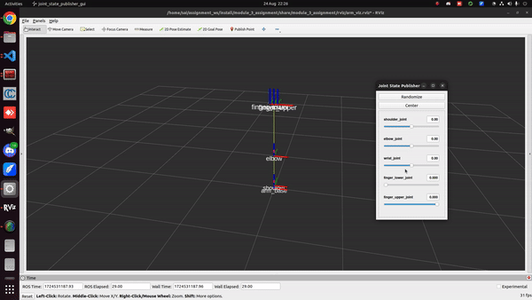
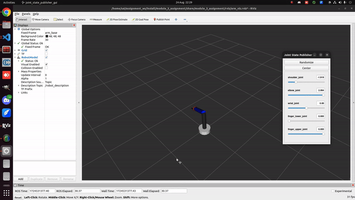
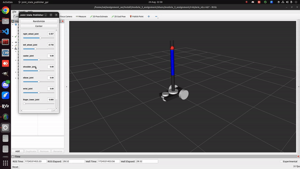
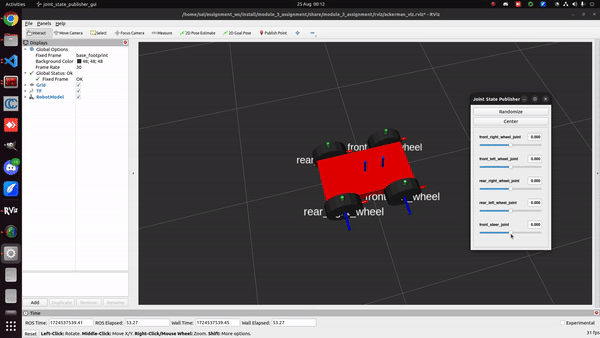

# Assignments for Module #3 : Robot structure with URDF

### Assignment 1: Robotic Arm Creation using TF

Note: Assignment 1 and 2, the launch file is the same.

In this task, the TFs for robotic arm is created with an urdf file.

```
$ cd ~/assignment_ws
$ colcon build && source install/setup.bash
$ ros2 launch module_3_assignment arm_urdf.launch.py
```



### Assignment 2: Joints Understanding

In this task, the TFs have visual elements and materials to it. This is done by adding a "visual" tag in the link elements of the urdf file.




### Assignment 3: Building Mobile Manupilator

In this task, the robotic arm is place of top of a differential drive robot.

#### Assignment 3.1



#### Assignment 3.2

In this task, a ackerman drive robot is simulated in rviz using an urdf file. 

```
$ cd ~/assignment_ws
$ colcon build && source install/setup.bash
$ ros2 launch module_3_assignment ackerman_urdf.launch.py
```



All the urdf files in this module uses xacro for better code formatting, readability and for reduce the code repetition. 