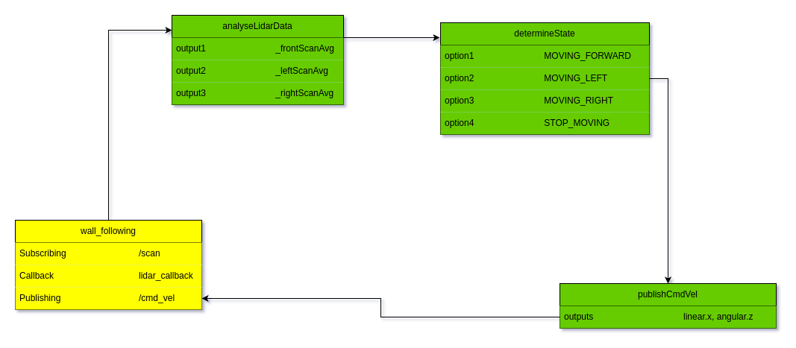

# Assignments for Module #4 : Robot Sensing
- Create all files in *module_4_assignment* package

### Assignment 1:

- Tasks: Refactor line-folowing project

    - Both line following and maze solving codes are refactored based on C++ design principles taught in the lectures.

    - That is [class, structures and enums] = `PascalCase`, class variables = `_camelCase`,
    Functions = `camelCase`, local variables = `camelCase_`, constants = `ITERATION` and file names = `snake_case`
    

### Assignment 2:

- Tasks: Create a software flow design for maze solving.





### Assignment 3.1: Wall Following Behaviour
- **Tasks**:
Create a maze in gazebo to perform wall following
    - Detect Wall on right with Lidar Sensor
    - Should create an envionrment of sqaure shape
    - Robot will keep the structure on its right


To Run:
```
$ cd assignment_ws
$ colcon build && source install/setup.bash
$ ros2 launch module_4_assignment wall_following_world.launch.py
```


### Assignment 3.2: Calculate Robot Speed
- **Tasks**:
Utilize Turltebo3 IMU sensor to calculate robot
    - Velocity
    - Acceleration

To Run:
```
$ cd assignment_ws
$ colcon build && source install/setup.bash
$ ros2 launch module_4_assignment get_imu_data.launch.py
```

### Assignment 4: Debug the package
- **Tasks**:
You have to find out errors in package `robot_sensing_debug`
    

#### General 
- unnecessay folders and file - urdf folder, bag folder, custom_sensors.launch.py file.
   
#### Debugging Maze solving 

In Maze solving launch file:
-  change node from `robot_sensing` to `robot_sensing_debug`.
- fix typo `mazes.world` to `maze.world`.
- `x_pose` is somewhere outside the maze, so changing `8.980152` to `-8.893530`.

In Maze solving source code:
- Modifed code design 
- use `std::min_element` instead of `std::max_element` to get the minimum distance to the obstacle.
- changed `/laser_scan` to `/scan`
- Instead of claculating the minimum distance in in one half of the front lidar scan that is `340 to 360`. calculate the minimum distance in 2 parts that is `350 to 360` and `0 to 10` and take the minimum of both.
- all obstacle distance should be greater than the threshold to go out of maze.
- `_frontThreshold` should be greater than `_frontObstacle`.
- If left obstacle is less than right obstacle then there is a wall on the left side, so turn robot to right side and vice versa.
- add `else if condition` to move straight if front obstacle is greater than the threshold.
- `_angularVel` and `_linearVel` variable should be used instead of constants.
- for the `case RobotState::MOVING_STRAIGHT`, `velocity y` is given instead of `velocity x` and moving straight should have `0 angular velocity`.
- for the `case RobotState::TURNING_LEFT`, turning left should have `0 linear velocity`.
- for the case `RobotState::TURNING_RIGHT`, turning right should have `0 linear velocity`.
- for the case `RobotState::OUT_OF_MAZE`, out of maze should have `0 linear and angular velocity`.
- reduce the threshold to 1.0f as it detects front obstacles from a long distance and reduce velocities to safe and smooth turn and not to overshoot the turn.
make the `_command` variable a class member variable.

To Run:
```
$ cd assignment_ws
$ colcon build && source install/setup.bash
$ ros2 launch robot_sensing_debug lidar_maze_solving.launch.py
```


#### Debugging Line following code

In Line following launch file:
- `pose x` is somewhere outside the line path, changing `-9.09` to `-5.889942` and `y pose` from `2.07` to `2.103010`.
- changed `robot_sensing` to `robot_sensing_debug`
- line_following.world have meshes pointing to the wrong path, changed the .dae files to the correct path.
- no launch file named `spawn_tb3.launch.py` in the turtlebot3_gazebo package, it is `spawn_turtlebot3.launch.py`.
-  `x and y pose` in launch arguments of spawn_turtlebot3 are missing.

In Line following source code:
- Modifed code design 
- add `else` to stop the robot when `edge.empty()` such that is stops when there is no edge.


To Run:
```
$ cd assignment_ws
$ colcon build && source install/setup.bash
$ ros2 launch robot_sensing_debug camera_line_following.launch.py
```
